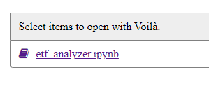
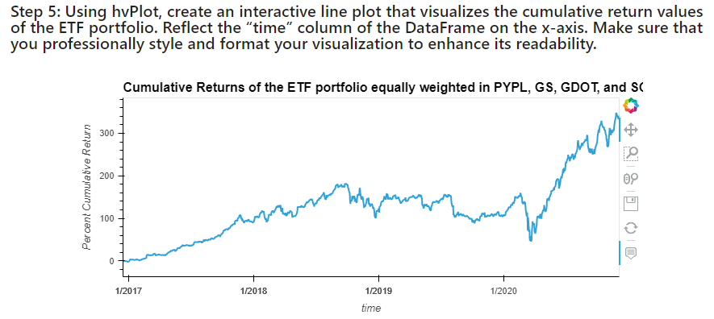

# ETF Analyzer, Deployed as a Web Application Using Voila

This Jupyter Notebook uses data from an SQL database to analyze the performance of a number of stocks (GOT, GS, PYPL, SQ) in a FinTech ETF.

The sqlalchemy library is used to create an engine that serves as the connection to the SQL database. Queries are used to select data of interest, and cumulative return metrics are plotted with the hvplot library.

The application is deployed on the web using the voila library. 

## Technologies

This program is written in Python (3.7.13) and developed using JupyterLabs notebooks using Windows. Additional libraries that are used in this application are pandas (1.3.5), numpy (1.21.5), hvplot (0.7.3), voila (0.2.16), and sqlalchemy libraries (1.4.32) (see parenthesis for versions used in program development).

You can install hvplot, sqlalchemy, and voila using `pip`: 
```python
pip install hvplot
pip install SQLAlchemy
pip install voila
```

## Installation Guide

Downloading the code & associated files using `git clone` from the repository is sufficient to download the program, ensure that the associated libaries (see Technologies section) are installed on your machine as well. If there are any issues with the library functions please refer to the versions used for app development (see Technnologies section for this information as well).  Please note that this is a Jupyter notebook. 

## Usage

This notebook is referencing data stored in the 'etf.db' file to make the analysis. 

The 'etf.db' file has multiple tables, one for each stock (PYPL, GS, GDOT, SQ) in the FinTech ETF. Each table has daily stock market data (time, open, high, low, close, volume, daily_returns) for that stock, from 12/16/2016 - 12/04/2020.

You can easily open the ipynb file in your web browser by executing a few lines of code in your command line. `cd` into the folder that your ipynb is stored, and simply type `viola`. A web application should open with a link to your notebook (or other ipynb's if others are included in the directory). Click the link, and your Jupyer Notebook should be displayed on your browser, with the address `localhost:8866`.

## Adding More Data to the Database

Adding more stock tables to the database is easy using the `sqlalchemy` library. Don't be limited to the data that's stored in the .db file already. 

If you already have a dataframe (`df`) with your data of interest (let's assume they're named the same as what we already have - time, open, high, low, close, volume, daily_returns), simply follow these steps to add the data to the database: 

Create a database connection string:
 `database_connection_string = 'sqlite:///etf.db'`

Create a database engine:
`engine = sqlalchemy.create_engine(database_connection_string)`

Add the dataframe to the database (let's say we're adding a table for a stock named 'XXX'): 
`df.to_sql('XXX', engine, index=False, if_exists='replace')`

You can confirm that your new table was created by running: 
`engine.table_names()`

The new table name ('XXX' in this example) in addition to the original table names (PYPL, GS, GDOT, SQ) should appear in the list. Be careful updating current tables in the database, as you don't want to accidentally overwrite any data. 

## Code examples

Pulling in data from the SQL database can be done with a few lines of code. 

For example, `pypl_dataframe = pd.read_sql_table('PYPL', engine)` reads in the PYPL table from the database and stores it in a dataframe named `pypl_dataframe`. 

An inner join is used to combine all of the data from the SQL database into one dataframe named `etf_portfolio`: 
```python
query = """
SELECT *
FROM PYPL
INNER JOIN GDOT ON GDOT.time = PYPL.time
INNER JOIN GS ON GS.time = PYPL.time
INNER JOIN SQ ON SQ.time = PYPL.time

etf_portfolio = pd.read_sql_query(query, engine)
```

Averaging daily return data is easily done with the following code:
`etf_portfolio['average_daily_returns'] = etf_portfolio[["daily_returns"]].mean(axis = 1)`

Assuming an equally weighted portfolio, cumulative returns are calcualted on the mix of stocks in the FinTech ETF that were selected from the database:
```python
etf_cumulative_returns = etf_portfolio_returns.copy()
etf_cumulative_returns["cumulative_returns"] = (1 + etf_cumulative_returns["average_daily_returns"]).cumprod() * 100 - 100
```

The `hvplot` library is used to plot the data so trends in cumulative returns can be easily analyzed: 
`etf_cumulative_returns.hvplot.line(x = "time", y = "cumulative_returns", title="Cumulative Returns of the ETF portfolio equally weighted in PYPL, GS, GDOT, and SQ", ylabel = "Percent Cumulative Return")`

Deploying this notebook to the web can be easily done with the voila library. After downloading the library, you can easily view this jupyter notebook on the web. By default your application will run on `localhost:8866`.

To view your jupyter notebook on the web, use Git Bash or another command line application. `cd` into the folder where your .ipynb file is stored, and type `voila`. 

A link to your notebook (and other ipynb's in your directory) should be available for you to click:



When you view the notebook, you should see markdown cells and ouput cells, your raw code cells should be hidden. This makes it easy to check out the results: 



## References

For more information about the libraries, check out the documentation!

[Voila library](https://voila.readthedocs.io/en/stable/using.html)

[Hvplot library](https://hvplot.holoviz.org/)

[Sqlalchemy library](https://www.sqlalchemy.org/)

## Contributors

Project contributors are the Rice FinTech bootcamp program team (instructor Eric Cadena) who developed the tasks for this project along with myself (Paula K) who's written the code in the workbook.
